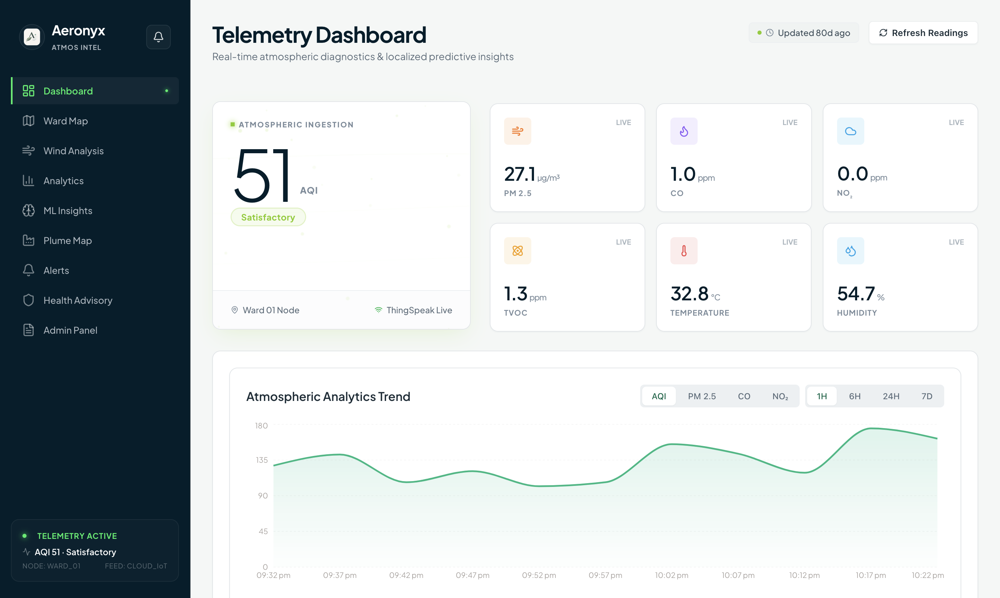
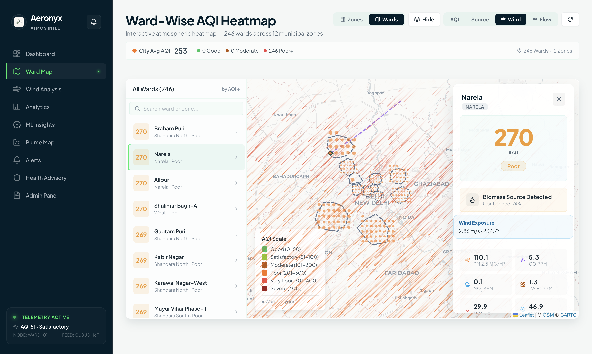
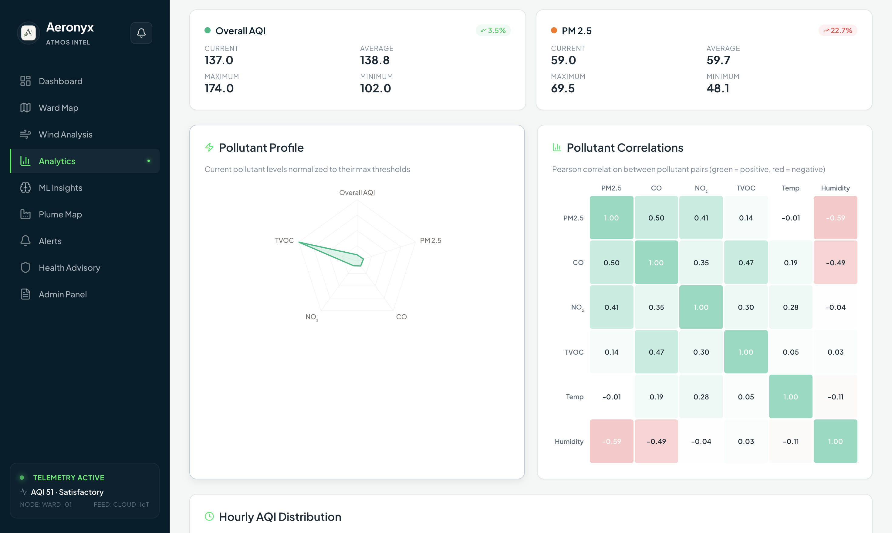
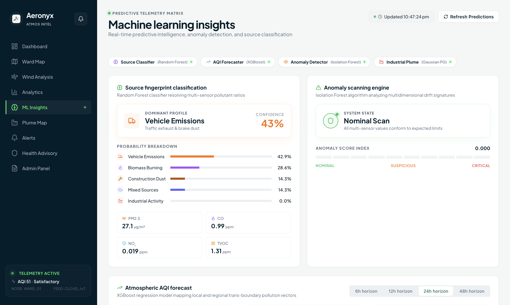
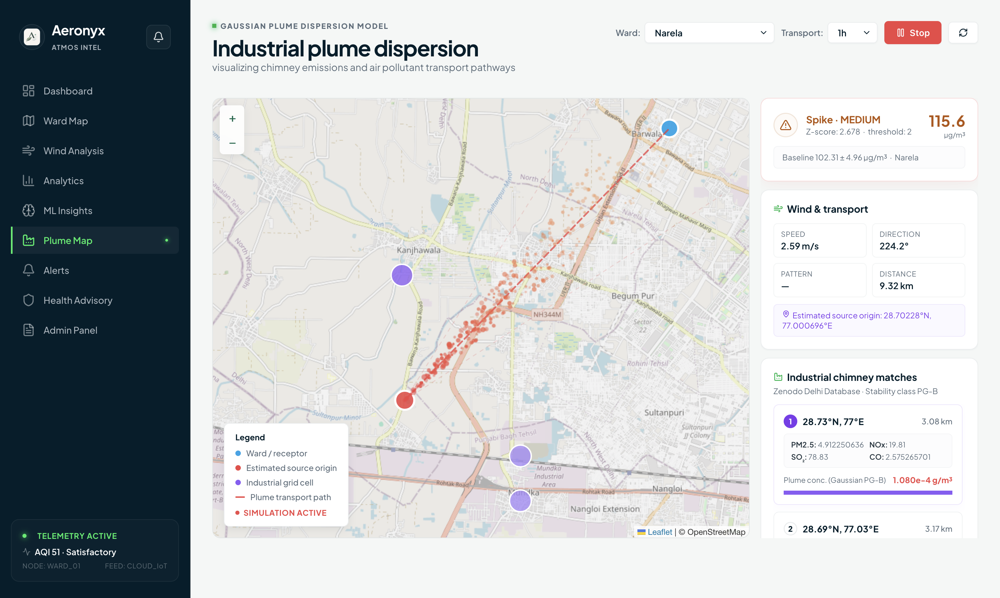
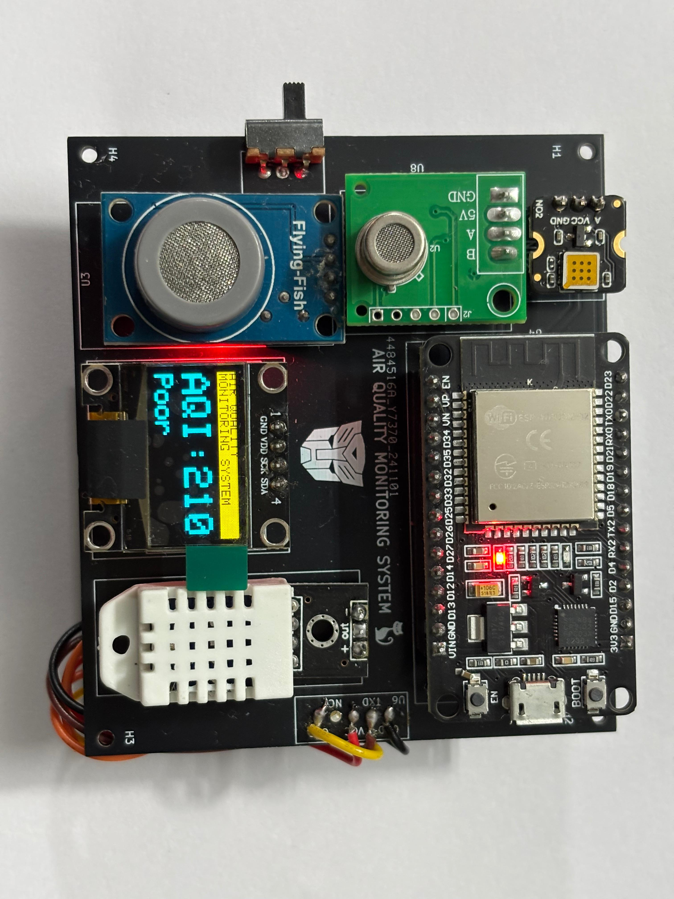
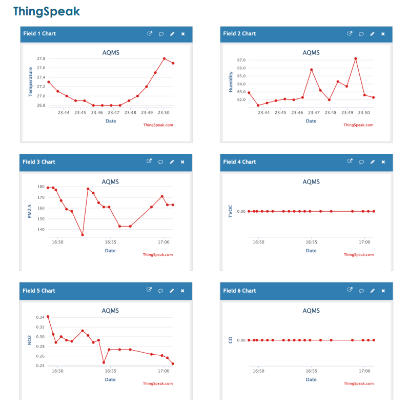

# Aeronyx - Air Quality Monitoring System

IoT-Enabled Real-Time Air Quality Intelligence Platform Ward-Level Monitoring | ML Source Detection | Wind-Aware Attribution | Smart Alerts | Policy Recommendations

## Overview

Aeronyx is a full-stack air quality monitoring platform covering all 250 municipal wards across 12 MCD zones of Delhi. It combines IoT sensor hardware (ESP32), cloud data processing (Next.js API routes), ML models, wind-aware atmospheric context, and an interactive React dashboard to provide real-time pollution intelligence.

**Key Metrics**: 250 wards | 12 zones | 7 configurable alert rules | 72-hour AQI forecast | Wind + plume + source attribution APIs

### Story

Imagine a city where every breath is monitored, every pollutant traced to its source, and every citizen empowered with actionable insights. Aeronyx turns this vision into reality by deploying a network of low‑cost IoT nodes across Delhi’s wards, streaming data to a serverless Next.js backend that runs machine‑learning models in real time. The platform not only shows live AQI numbers but also tells you *why* the air is polluted—whether it’s traffic, construction, or biomass burning—and forecasts how it will change over the next three days. With wind‑aware attribution, city officials can see exactly where pollution is coming from and target interventions where they matter most. Residents receive personalized health alerts, while planners get policy recommendations backed by data. In short, Aeronyx doesn’t just measure air quality—it helps improve it.

## Screenshots







## System Architecture

ESP32 + Sensors (PM2.5, CO, NO2, TVOC, DHT22)
       | every 30s via WiFi
       v
ThingSpeak Cloud (Channel 2697383)
       | REST API polling (30s)
       v
Next.js Backend (API Routes)
  - ThingSpeak Data Fetcher (live + demo mode)
  - ML Pipeline (RF source, XGBoost forecast, IF anomaly)
  - Wind Service (station cache + interpolation)
  - Atmospheric Layer (trajectory + flow chain)
  - Bayesian-Style Source Attribution
  - Alert Engine (7 rules, 5-min debounce)
  - SQLite Storage (async via Prisma or similar)
  - WebSocket Broadcast (via Socket.io or similar)
       | REST + WebSocket
       v
Next.js Frontend (React)
  - 9 Interactive Pages
  - Leaflet Ward Map (250 wards)
  - Wind Analysis Page
  - Recharts Visualization
  - Client-side ML Fallback

## Features

| Feature | Description |
|---------|-------------|
| Real-Time Dashboard | Live AQI gauge, 6-metric grid, time-series chart, health advisory |
| 250-Ward Map | Interactive Leaflet map with zone/ward toggle, color-coded AQI, search |
| ML Source Detection | Random Forest classifier identifying vehicle, industrial, construction, biomass, mixed sources |
| AQI Forecasting | XGBoost model predicting AQI 1-72 hours ahead with diurnal patterns |
| Anomaly Detection | Isolation Forest flagging unusual sensor patterns |
| Wind Intelligence | Wind station cache, interpolated wind field, seasonal pattern fallback |
| Plume + Trajectory APIs | Backward trajectory, upwind lookup, and zone flow chain endpoints |
| Source Attribution (Bayesian-style) | Probabilistic source mix using pollutant fingerprints + temporal + wind context |
| Smart Alerts | 7 configurable rules with severity levels and 5-min debounce |
| Health Advisory | Population-specific guidance for general public and vulnerable groups |
| Admin Policy Panel | Source-specific intervention recommendations for municipal officials |

## Tech Stack

| Layer | Technology | Version |
|-------|------------|---------|
| Backend | Next.js API Routes | 15.x |
| Database | SQLite + Prisma (async) | Latest |
| ML | scikit-learn (RF, IF) + XGBoost | >=1.3, >=2.0 |
| Frontend | React + Next.js | 19.2.0 / 15.x |
| Maps | Leaflet + react-leaflet | 1.9.4 / 5.0.0 |
| Charts | Recharts | 3.8.0 |
| Animations | Framer Motion | 12.35.1 |
| IoT | ESP32 + ThingSpeak | Channel 2697383 |
| Deployment | Vercel | - |

## Project Structure

```text
Aeronyx/
  app/
    admin/                 # Admin page
    advisory/              # Health advisory page
    alerts/                # Alerts page
    analytics/             # Analytics page
    api/                   # Next.js API routes (backend)
      live.js              # /api/live, /api/advisory
      history.js           # /api/history
      wards.js             # /api/wards (250 wards + 12 zones)
      ml.js                # /api/ml/* (source, forecast, anomaly)
      alerts.js            # /api/alerts/* (rules, stats)
      policy.js            # /api/policy
      wind.js              # /api/wind/*
      plume.js             # /api/plume/*
      attribution.js       # /api/attribution/*
    components/            # Reusable React components
    hooks/                 # Custom React hooks (e.g., useData)
    map/                   # Map-related pages/components
    ml/                    # ML utilities and model loading
    plume/                 # Plume map page
    services/              # Service classes (if any)
    wind/                  # Wind analysis page
    AppShell.tsx           # App layout wrapper
    globals.css            # Global styles
    layout.tsx             # Root layout
    page.tsx               # Home page
  lib/
    alerts/                # Alert logic
    attribution/           # Source attribution
    db/                    # Database connection and models
    ml/                    # ML utilities and model loading
    thingspeak/            # ThingSpeak API wrapper
    utils/                 # Utility functions
    weather/               # Weather API integration
  public/
    favicon.ico            # Favicon
    aeronyx.png            # Logo
    wards.json             # GeoJSON (12 zones + 246 wards) for frontend
  data/
    alert_history.json     # Historical alert data
    alert_rules.json       # Alert rule configurations
    industrial_sources.csv # Industrial source data for ML
    sensor_readings.json   # Sensor data storage
    wind_history.json      # Historical wind data
  AGENTS.md                # Agent instructions for this project
  CLAUDE.md                # Project-specific instructions
  DESIGN.md                # Design specifications
  README.md                # This file
  eslint.config.mjs        # ESLint configuration
  next-env.d.ts            # Next.js TypeScript types
  next.config.ts           # Next.js configuration
  package-lock.json        # Locked dependencies
  package.json             # Dependencies and scripts
  postcss.config.mjs       # PostCSS configuration
  skills-lock.json         # Locked skills
  tsconfig.json            # TypeScript configuration
```
## Hardware - IoT Sensor Node





| Component | Model | Measurement |
|-----------|-------|-------------|
| Microcontroller | ESP32-WROOM-32 | WiFi/BLE, Dual-core 240MHz |
| PM2.5 Sensor | WINSEN ZPH02 (laser) | 0-1000 ug/m3 |
| CO Sensor | MQ-7 | 20-2000 ppm |
| NO2 Sensor | DFRobot MEMS | 0-5 ppm |
| TVOC Sensor | WINSEN ZP07-MP503 | 0-50 ppm |
| Temp/Humidity | DHT22 | -40 to 80C, 0-100% |
| Display | SSD1306 OLED 0.96" | 128x64 px |
| Power | 3.7V LiPo + MT3608 boost | ~8h runtime |

**Estimated cost per node**: INR 5,200

## ML Models

### 1. Pollution Source Classifier

- **Algorithm**: Random Forest (150 trees, max_depth=12)
- **Classes**: vehicle, industrial, construction, biomass, mixed
- **Features**: pm25, co, no2, tvoc, temperature, humidity, hour, pm25/co ratio, tvoc/no2 ratio
- **Fallback**: Rule-based detection (client-side + server-side) when model unavailable

### 2. AQI Forecaster

- **Algorithm**: XGBoost Regressor (200 rounds, lr=0.08)
- **Output**: Hourly AQI predictions for 1-72 hours
- **Features**: hour, day_of_week, pollutants, temperature, humidity, lag features (1h/3h/6h)

### 3. Anomaly Detector

- **Algorithm**: Isolation Forest (150 trees, contamination=0.05)
- **Output**: is_anomaly flag + anomaly_score (0-1)

## Plume Model

The plume model predicts the dispersion of pollutants from sources using wind data and atmospheric stability. It provides backward trajectory analysis to identify upwind sources contributing to a ward's pollution, and forward plume simulation to estimate impact areas. The model uses Gaussian plume approximation adjusted for urban canopy layer, integrating real-time wind fields from the Wind Service. Outputs include: plume concentration maps, source contribution percentages, and travel time estimates.

## API Endpoints

All API endpoints are under `/api` in the Next.js app.

| Method | Endpoint | Description |
|--------|----------|-------------|
| GET | `/api/live` | Latest sensor reading |
| GET | `/api/advisory` | Health advisory for current AQI |
| GET | `/api/history?hours=24` | Historical readings |
| GET | `/api/wards` | All 258 zone+ward readings |
| GET | `/api/wards/{ward_id}` | Single ward reading |
| GET | `/api/ml/source` | ML source classification |
| GET | `/api/ml/forecast?horizon=24` | AQI forecast |
| GET | `/api/ml/anomaly` | Anomaly detection |
| GET | `/api/ml/summary` | Combined ML analysis |
| GET | `/api/alerts` | Alert history |
| GET | `/api/alerts/rules` | Alert rules |
| GET | `/api/policy?source=vehicle` | Policy recommendations |
| GET | `/api/wind/current` | Station wind snapshot |
| GET | `/api/wind/field?grid_size=12` | Interpolated wind vector field |
| GET | `/api/wind/history?hours=24` | Wind history snapshots |
| GET | `/api/wind/at?lat=...&lon=...` | Wind at a specific point |
| GET | `/api/wind/upwind/{ward_id}` | Upwind wards for target ward |
| GET | `/api/wind/seasonal` | Seasonal wind profile metadata |
| GET | `/api/plume/trajectory/{ward_id}?hours=3` | Backward trajectory from ward |
| GET | `/api/plume/upwind/{ward_id}` | Upwind wards via plume context |
| GET | `/api/plume/flow-chain/{zone_id}` | Wind flow order within zone |
| GET | `/api/attribution/ward/{ward_id}` | Full ward source attribution |
| GET | `/api/attribution/zone/{zone_id}` | Zone-level source attribution |
| GET | `/api/attribution/city` | City-wide source contribution summary |
| GET | `/api/health` | Backend health check |
| WS | `/ws/live` | Real-time WebSocket feed |

## Quick Start

1. Clone the repository
2. Install dependencies:
   ```bash
   npm install
   ```
3. Create a `.env.local` file in the root with:
   ```
   THINGSPEAK_CHANNEL_ID=2697383
   THINGSPEAK_READ_API_KEY=your_thingspeak_read_key
   # Optional: OWM_API_KEY for real wind data
   ```
4. Run the development server:
   ```bash
   npm run dev
   ```
5. Open [http://localhost:3000](http://localhost:3000) in your browser.

## Deployment

The easiest way to deploy your Next.js app is to use the [Vercel Platform](https://vercel.com/new?utm_medium=default-template&filter=next.js&utm_source=create-next-app&utm_campaign=create-next-app-readme) from the creators of Next.js.

1. Push the repository to GitHub
2. Import the project on Vercel
3. Set the environment variables in Vercel dashboard:
   - `THINGSPEAK_CHANNEL_ID`
   - `THINGSPEAK_READ_API_KEY`
   - `OWM_API_KEY` (optional)
4. Vercel will automatically build and deploy the application.

---

**Note**: Replace the placeholder screenshot URLs with actual screenshots of your deployed application.

---

Built with ESP32, Next.js, React, scikit-learn, XGBoost, Leaflet, and Recharts